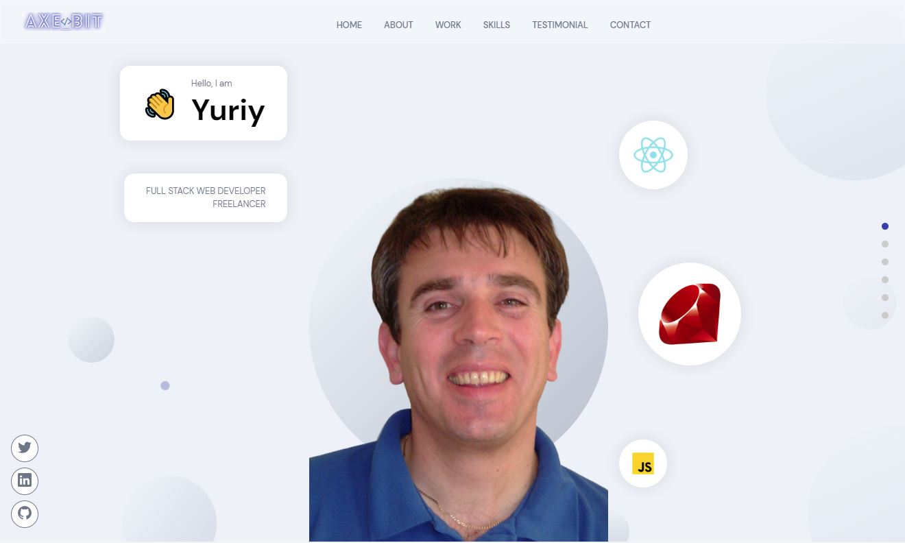
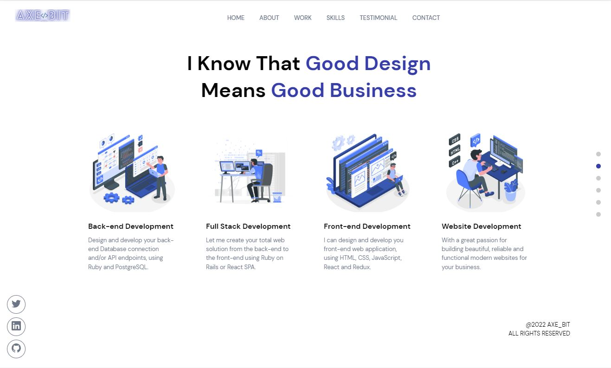
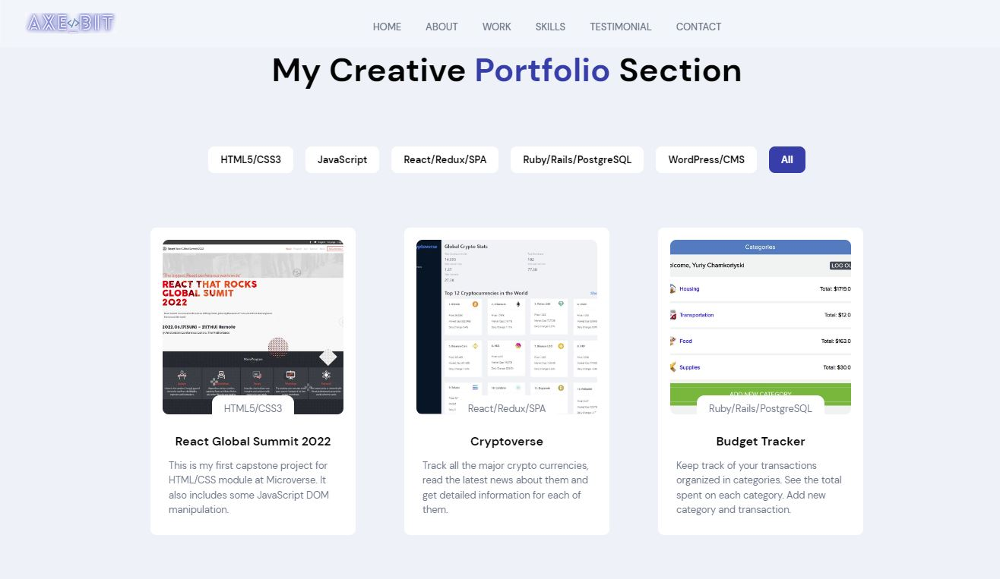
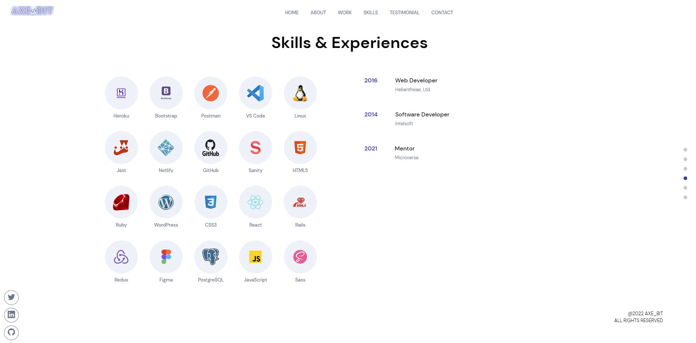
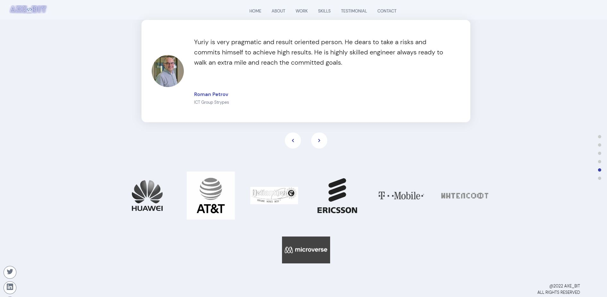
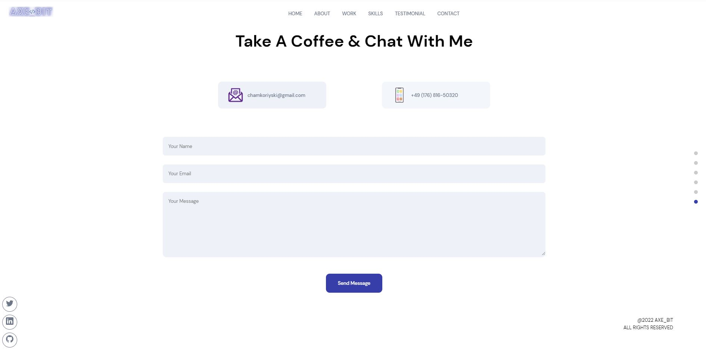

# Yuriy Chamkoriyski's React Portfolio

> Showcase projects portfolio.
## Built With

- Major languages: Sass, JavaScript, React
- Backend: Sanity
- Tools used: Framer motion, React Icons
## Screenshots

## Live Link

You can view the current deployment by clicking the link bellow:

[Live Link](https://yuriy-portfolio.netlify.app/)
### Deployment

- Using [Vercel](https://vercel.com)
## Author

👤 **Yuriy Chamkoriyski**

- GitHub: [@Hombre2014](https://github.com/Hombre2014)
- Twitter: [@Chamkoriyski](https://twitter.com/Chamkoriyski)
- LinkedIn: [axebit](https://linkedin.com/in/axebit)

## 🤝 Contributing

Contributions, issues, and feature requests are welcome!

Feel free to check the [issues page](https://github.com/Hombre/react_portfolio/issues).

## Show your support

Give a ⭐️ if you like this project!

## Acknowledgments

Credits and attribution for the photos in About section: 
 
[Web illustrations by Storyset](https://storyset.com/web) 
[Technology illustrations by Storyset](https://storyset.com/technology) 
[Designed by upklyak/Freepik](http://www.freepik.com) 

Thanks to JavaScript Mastery for inspirational [video](https://www.youtube.com/watch?v=3HNyXCPDQ7Q).
## 📝 License

This project is [MIT](./license.md) licensed.
